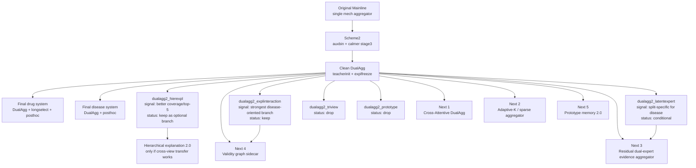

# DualAgg 3.0 Experiment Map

## Goal

Build the next-stage `DualAgg` roadmap from the current validated backbone, separating:

- validated backbone pieces
- explored structural branches and their outcomes
- next architecture upgrades worth full implementation

## Current Backbone

- Training backbone:
  - `clean DualAgg = dualagg-minimal-teacherinit + explfreeze`
- Final system:
  - `cold-drug`: `clean DualAgg + longselect + post-hoc calibration`
  - `cold-disease`: `clean DualAgg + post-hoc calibration`

## Structural Status

- Keep as default backbone:
  - `clean DualAgg`
- Keep as split-specific branch:
  - `dualagg2_explinteraction` for `cold-disease`
- Keep as weak-signal branch:
  - `dualagg2_hierexpl`
- Conditional only:
  - `dualagg2_latentexpert`
- Drop:
  - `dualagg2_triview`
  - `dualagg2_prototype`

## Experiment Graph

## Next Architecture Upgrades

### 1. Cross-Attentive DualAgg

Core idea:
- keep `evidence` and `explanation` decoupled
- add controlled cross-view attention between the two bag representations
- allow explanation knowledge transfer without letting explanation take over pair prediction

Why it is high priority:
- current `DualAgg` already proves decoupling is right
- current agreement is still too coarse
- this is the cleanest way to improve pair/path cooperation

Target metrics:
- pair AUROC/AUPRC
- hard MRR
- hard top-1

### 2. Adaptive-K / Sparse Aggregator

Core idea:
- replace fixed `top_k` with reliability-conditioned dynamic sparsity
- use adaptive `k`, `sparsemax`, or `entmax`-style aggregation

Why it is high priority:
- current gains from `longselect` suggest selection granularity matters
- fixed top-k is likely not the best inductive bias

Target metrics:
- pair AUPRC
- hard top-1
- hard top-5

### 3. Residual Dual-Expert Evidence Aggregator

Core idea:
- keep shared evidence branch
- add:
  - gold-aware evidence expert
  - no-gold latent evidence expert
- mix them through residual gating rather than replacement

Why it is high priority:
- `latentexpert` shows disease-side signal
- current issue is over-commitment, not lack of value

Target metrics:
- disease pair AUROC/AUPRC
- path-binary AUROC/AUPRC

### 4. Validity Graph Sidecar

Core idea:
- build a light path graph inside each bag
- use path-path support/conflict only for validity estimation and calibration
- do not let it directly replace pair-serving evidence aggregation

Why it is high priority:
- validity/calibration has been the most stable extra gain
- path interaction likely belongs in validity, not in pair mainline

Target metrics:
- controlled path-binary AUROC/AUPRC
- calibration stability

### 5. Prototype Memory 2.0

Core idea:
- replace hard prototype conditioning with a retrieval-style explanation memory
- prototypes serve as residual context, not direct score controllers

Why it is lower priority:
- first prototype version collapsed hard ranking
- likely still useful, but only after cross-view transfer and validity are stronger

Target metrics:
- hard top-1
- explanation consistency

## Recommended Execution Order

1. `Cross-Attentive DualAgg`
2. `Adaptive-K / sparse aggregator`
3. `Residual dual-expert evidence aggregator`
4. `Validity graph sidecar`
5. `Prototype memory 2.0`

## Minimal Run Matrix

For each new route, run:

1. `cold-drug`
2. `cold-disease`
3. `fixed_hard_1to4` controlled path-binary

Report:

- Pair AUROC
- Pair AUPRC
- hard MRR
- hard top-1
- hard top-5
- path-binary AUROC
- path-binary AUPRC

## Decision Rule

- Promote to backbone candidate only if it beats clean `DualAgg` on at least one split without collapsing the other split.
- Promote to split-specific branch if it improves one split clearly with acceptable trade-off.
- Drop if it loses on pair and hard ranking simultaneously.
